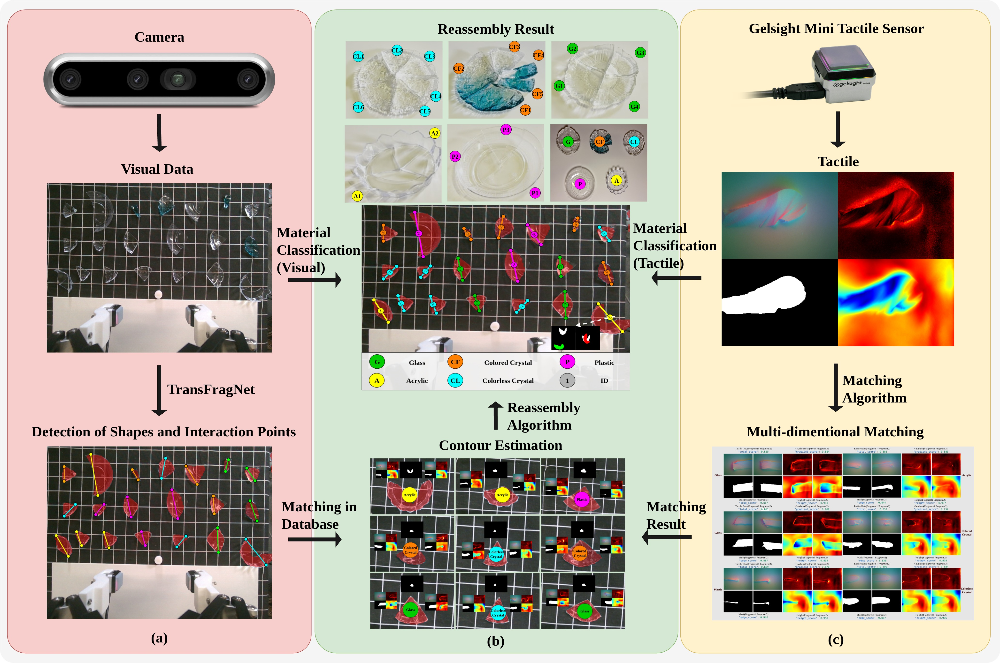
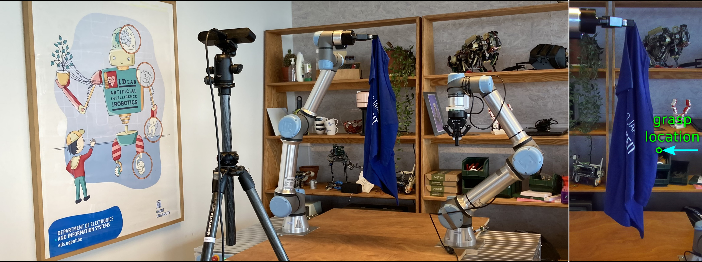

---
#
# By default, content added below the "---" mark will appear in the home page
# between the top bar and the list of recent posts.
# To change the home page layout, edit the _layouts/home.html file.
# See: https://jekyllrb.com/docs/themes/#overriding-theme-defaults
#
layout: page
---

Hi! I'm Qihao Lin, currently an M.S. student at [Carnegie Mellon University](https://www.cmu.edu) working on assistive robotics. My research interests lie in robot perception and manipulation, machine learning and human–robot interaction. I am a member of the [Robotic Caregiving and Human Interaction (RCHI) Lab](https://rchi-lab.github.io), where I am advised by [Zackory Erickson](https://zackory.com/).

I received my BS degree in Aerospace Engineering at Sun Yat-sen University. During my undergraduate reaserch, I was in [Robotics and Intelligent Sensing Lab](https://www.x-mol.com/groups/xia_chongkun) advised by Chongkun Xia. As an undergraduate researcher, I worked on several projects related to robotic perception and manipulation, including deformable and transparent object sensing and manipulation.

In addition to academic research, I gained industry experience as a machine learning engineer intern at Shenzhen Haoya IoT Co., Ltd., where I worked on algorithm development for sign language translation systems. My work involved developing on device sign language translation AI models, as well as processing and analyzing sign language data. It further strengthened my interest in developing assistive robotic systems that are both technically robust and practically meaningful.

Besides doing reaserch, I also have interest in music and sports. I used to be a member of a band called Decide it tommorow, as singer and guitarist. Also I like to do basketball, jogging and workout. Feel free to contact me if there's anything you feel interesting!

---

### Featured Articles

#### [Transparent Fragments Contour Estimation via Visual-Tactile Fusion for Autonomous Reassembly](https://arxiv.org/abs/2603.20290)

Paper: [arXiv](https://arxiv.org/abs/2603.20290)  
Code: [GitHub](https://github.com/Keithllin/Transparent-Fragments-Contour-Estimation)

**Abstract:** The contour estimation of transparent fragments is very important for autonomous reassembly, especially in the fields of precision optical instrument repair, cultural relic restoration, and identification of other precious device broken accidents. Different from general intact transparent objects, the contour estimation of transparent fragments face greater challenges due to strict optical properties, irregular shapes and edges. To address this issue, a general transparent fragments contour estimation framework based on visual-tactile fusion is proposed in this paper. First, we construct the transparent fragment dataset named TransFrag27K, which includes a multiscene synthetic data of broken fragments from multiple types of transparent objects, and a scalable synthetic data generation pipeline. Secondly, we propose a visual grasping position detection network named TransFragNet to identify, locate and segment the sampling grasping position. And, we use a two-finger gripper with Gelsight Mini sensors to obtain reconstructed tactile information of the lateral edge of the fragments. By fusing this tactile information with visual cues, a visual-tactile fusion material classifier is proposed. Inspired by the way humans estimate a fragment's contour combining vision and touch, we introduce a general transparent fragment contour estimation framework based on visual-tactile fusion, demonstrates strong performance in real-world validation. Finally, a multi-dimensional similarity metrics based contour matching and reassembly algorithm is proposed, providing a reproducible benchmark for evaluating visual-tactile contour estimation and fragment reassembly. The experimental results demonstrate the validity of the proposed framework.

#### [A dataset and benchmark for robotic cloth unfolding grasp selection: The ICRA 2024 Cloth Competition](https://doi.org/10.1177/02783649251414885)

De Gusseme V-L, Lips T, Proesmans R, et al. *A dataset and benchmark for robotic cloth unfolding grasp selection: The ICRA 2024 Cloth Competition*. *The International Journal of Robotics Research (IJRR)*.  
Authors include: Victor-Louis De Gusseme, Thomas Lips, Remko Proesmans, ... , **Qihao Lin**, ...  
DOI: [10.1177/02783649251414885](https://doi.org/10.1177/02783649251414885)

**Abstract:** Robotic cloth manipulation suffers from a lack of standardized benchmarks and shared datasets for evaluating and comparing different approaches. To address this, we created a benchmark and organized the ICRA 2024 Cloth Competition, a unique head-to-head evaluation focused on grasp pose selection for in-air robotic cloth unfolding. Eleven teams participated in the competition, utilizing the publicly released dataset of 500 real-world robotic grasp attempts for cloth unfolding and employing diverse approaches to generate in-air unfolding grasps. Analysis of the competition results revealed insights about the trade-off between grasp success and coverage, the surprisingly strong achievements of hand-engineered methods and a significant discrepancy between competition performance and prior work, underscoring the importance of independent, out-of-the-lab evaluation in robotic cloth manipulation. We also expanded the dataset with 176 competition evaluation trials, resulting in a dataset of 679 unfolding demonstrations across 34 garments. This dataset is a valuable resource for developing and evaluating grasp selection methods, particularly for learning-based approaches. We hope that the benchmark, dataset, and competition results can serve as a foundation for future benchmarks and drive further progress in data-driven robotic cloth manipulation.

---

### Contact

**Email**: qihaol@andrew.cmu.edu
